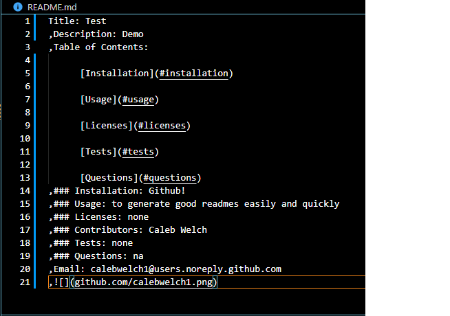
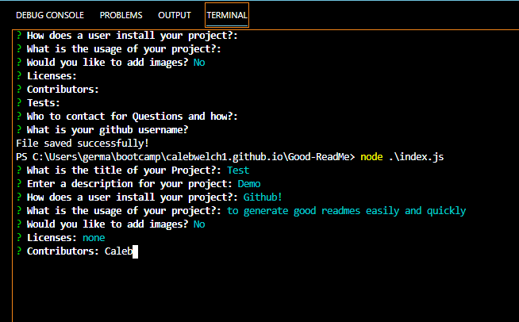

Title: Good ReadMe Generator
,Description: Writing ReadMe's can be time consuming. With this project you will be able to use a Command Line Interface to generate ReadMe's quickly and easily
,Table of Contents: 

      [Installation](#installation)

      [Usage](#usage)

      [Licenses](#licenses)

      [Tests](#tests)

      [Questions](#questions)
,### Installation: You can install this project at github.com/calebwelch1/Good-ReadMe
,### Usage: To use the application simply download the project from github and install inquirer. Then run the application and follow the prompts to generate a Readme
,,,### Licenses: n/a
,### Contributors: Caleb Welch
,### Tests: n/a
,### Questions: You can contact me at calebwelch1@users.noreply.github.com
,Email: calebwelch1@users.noreply.github.com
,